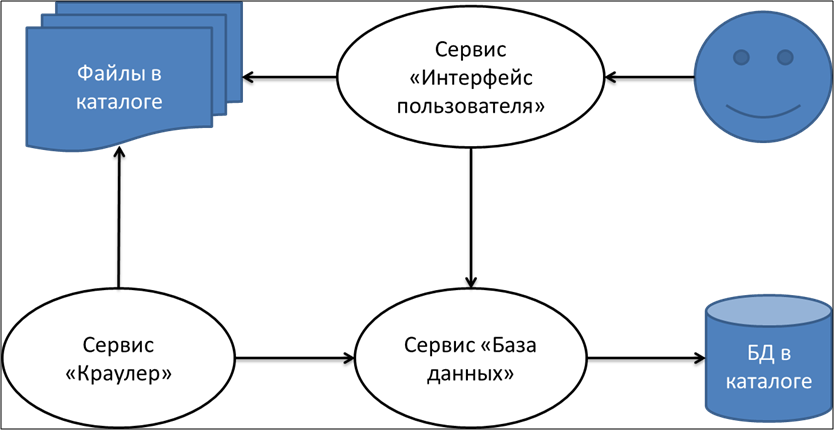
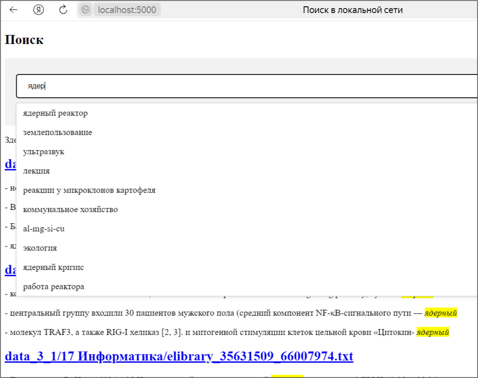

# Поисковый сервис для локальной сети предприятия (Версия - 6)

Сканирует в постоянном режиме папку с файлами и сохраняет в базе для полнотекстового поиска.

Предоставляет интерфейс как в любом поисковике в интернет.
В поисковой строке можно вводить запросы.

Под поисковой строкой располагаются результаты полнотекстового поиска.

По гиперссылкам файлы выкачиваются на компьютер пользователя.

# Установка

Скачайте файлы проекта себе по ссылке https://disk.yandex.ru/d/vo_4n6md6qlzGQ

Перейдите в каталог со скачанными файлами и действуйте по инструкции в файле instruct.txt

# Требование к инфраструктуре для установки

Должен быть установлен Docker. Интернет не нужен. Все образы уже подготовлены. Нужно только скачать и запустить (см. раздел "Инсталляция" выше).

# Структура системы

Система состоит из трех сервисов (контейнеров). Взаимосвязь сервисов, внешних ресурсов и пользователей придставлена на схеме.

# Бонус

В качестве бонуса в системе присутствует дополнительный функционал подсказок в поисковой строке. Реализован на модели машинного обучения Doc2Vec. На рисунке ниже демонстрируется его работа.

